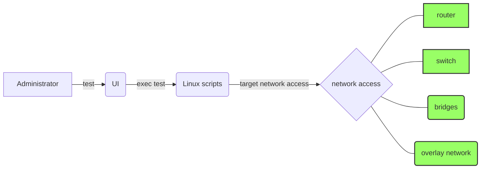

# QoStrouble
##### Dashboard for troubleshooting network quality of service 
## how the QoStrouble tool works:

 * The QoStrouble tool can be used through a virtual machine or a physical machine or or a an advanced virtualization clould plateform soon (**docker swarm cluster** , **kubernetes cluster**) . For more
details on the installation steps, please sent a request through maill to `ahmd.belhoula@gmail.com` to consult the file Spec.

### the utility of each directory:

* The CSS directory contains the different CSS files (application desesigne).
* The directory Dl contains the different temporary files of downloads.
* The fonts and font-awesome folders contain the continuation of the deseigne.
* The Images and img folders contain the different images and figures used in the Web application.
* The js folder contains the different JavaScript scripts.
* The Perl folder contains the different perl scripts (client and server).
* he results folder contains the temporary results of the tests before which they will be displayed in the web interface.
* The folder Ul contains the different files to send (1 Mo, 100 Mo, and 1 Go). Any other file to send must be put in this folder.
* The folder web contains the user views  (index.html, Ping.html, Trace.html, Dns.html, Web.Html ...etc).

# application architecture

